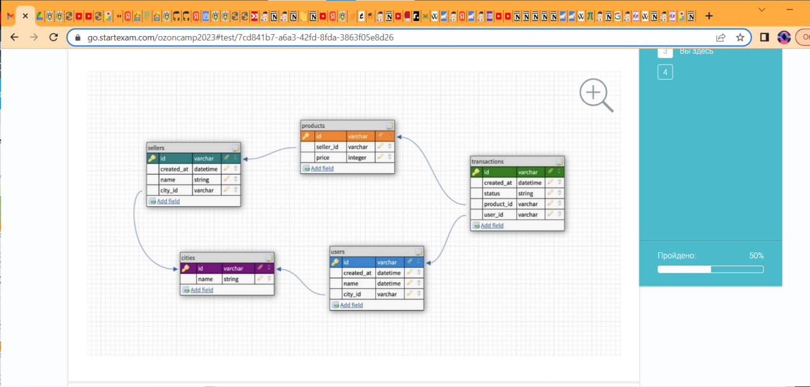
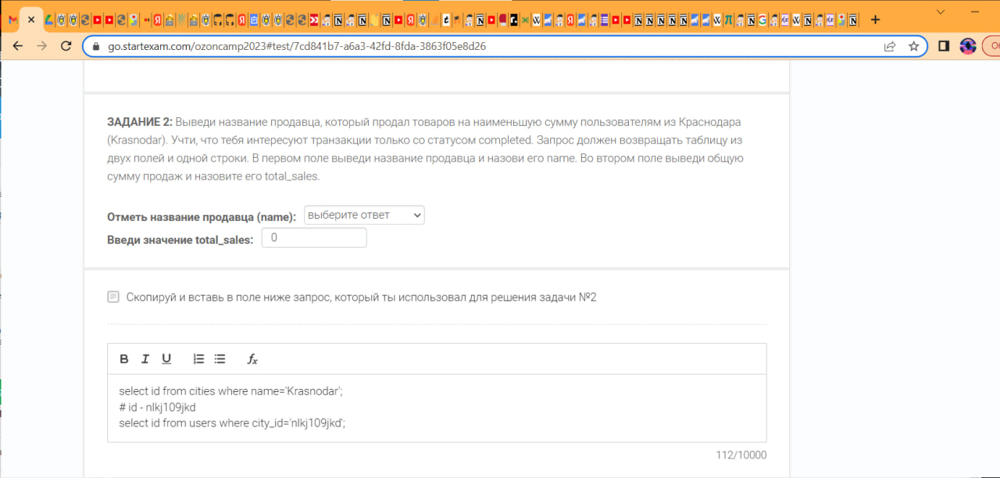
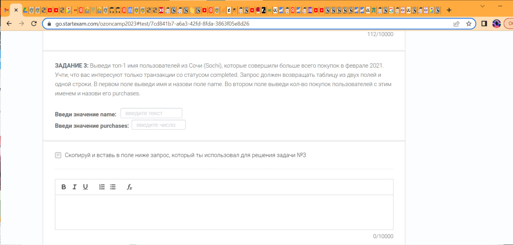
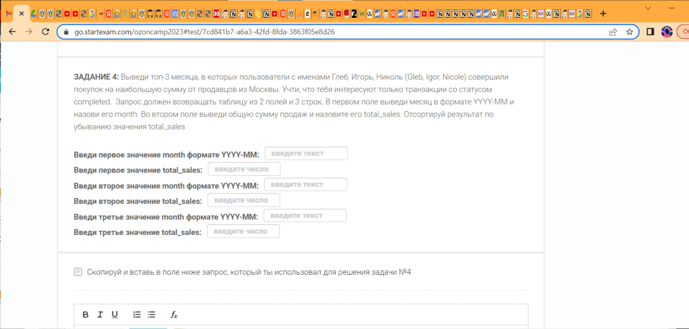

# Ozon Camp contest

Отборочный в ozon по SQL на аналитика/продакт менеджера/проджект менеджера. Прошел, решив все. Прежде всего, скачайте файл `SQL сырые данные.txt`.

## Схема связей таблиц в БД

## 1 задание | easy

Найти количество транзакций со статусом error.

## 2 задание | medium

## 3 задание | medium

## 4 задание | hard

