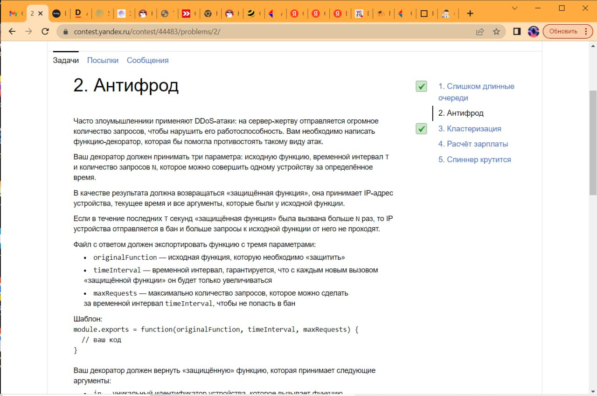
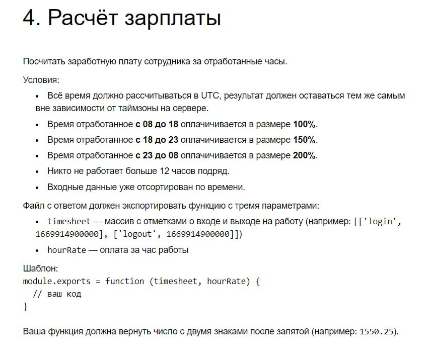
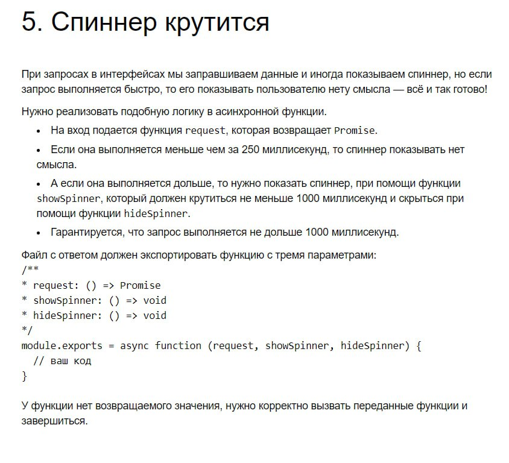

# Frontend

Задачи с 1 этапа отбора на стажировку по Фронтенду от Яндекс. Решил правильно первые 3, этого хватило, чтобы пройти на интервью.

```
1 - OK
2 - OK
3 - OK
4 - WA
5 - RE
```

### Task 1

Задачка на реализацию очереди с оптимальным добавлением/удалением минимумов и максимумов.

### Task 2



### Task 3

Написать функцию кластеризации (плохо помню условие).

### Task 4



### Task 5

