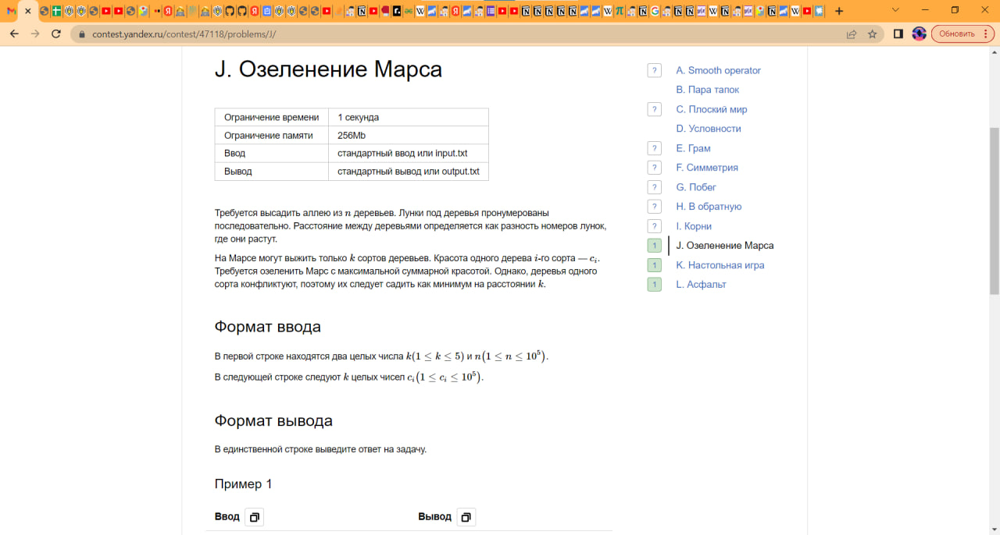
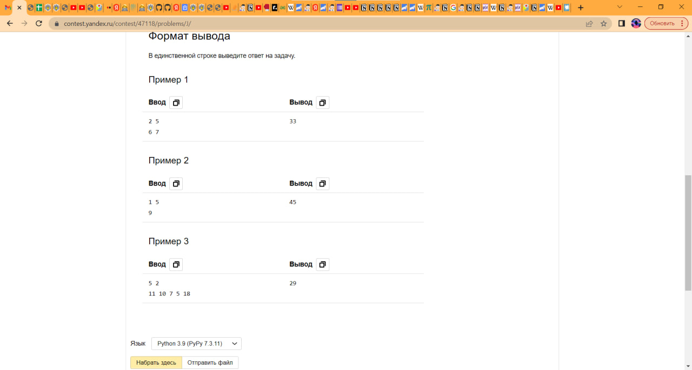
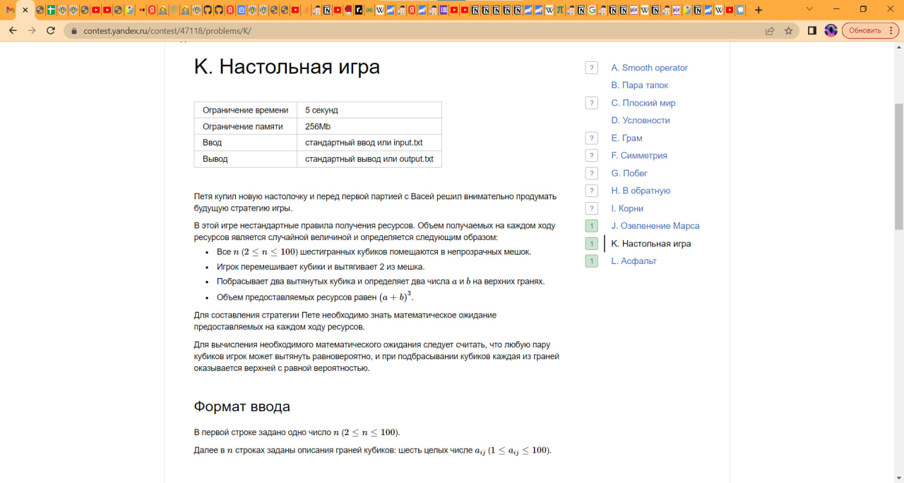
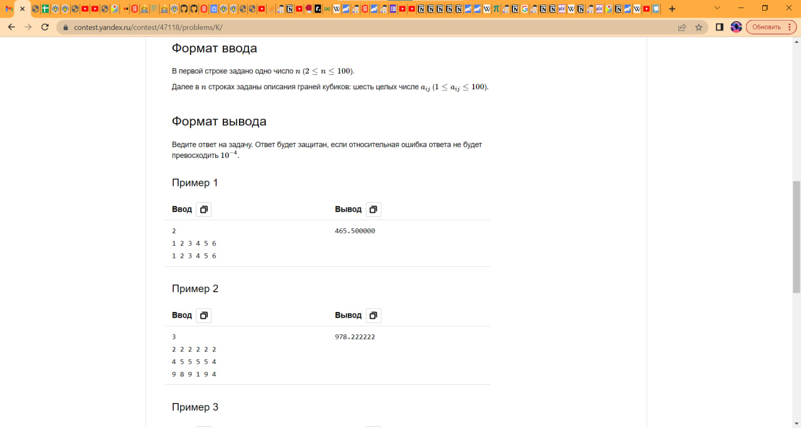
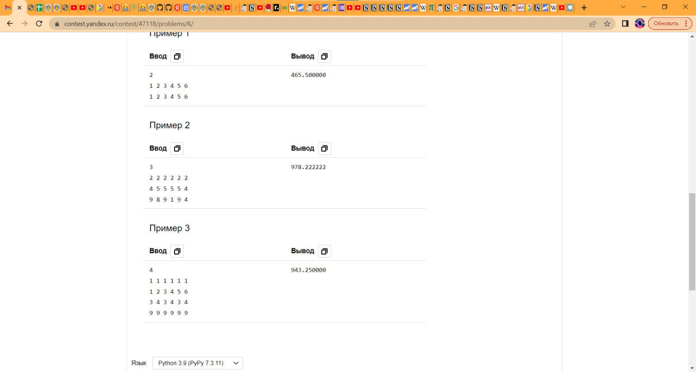
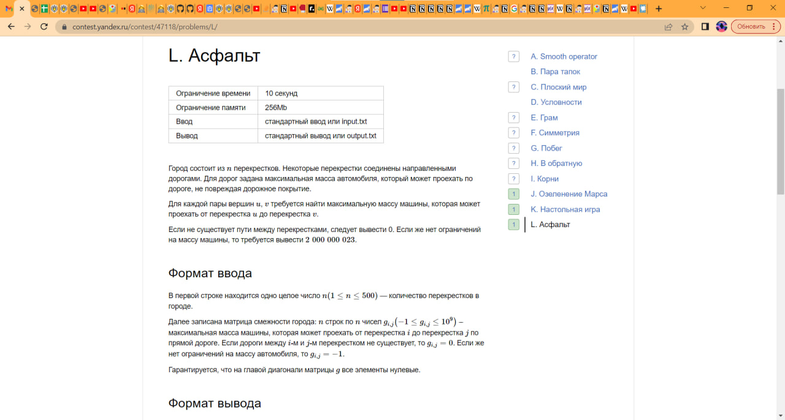
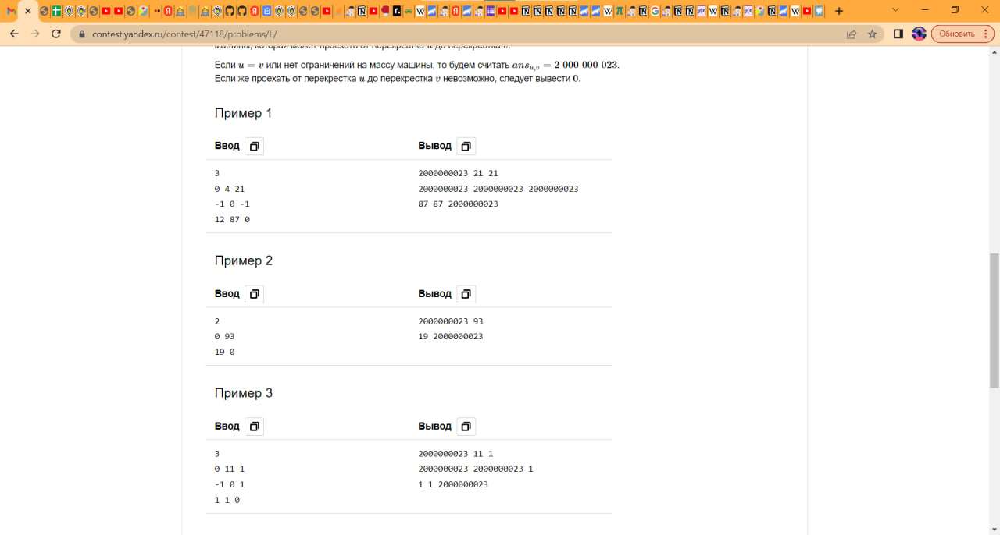

# ШАД

Задания по программированию с 1 и 2 этапа в Школу Анализа Данных Яндекса.

## Первый этап
### Задача 1

### Задача 2

### Задача 3

## Второй этап

### 1 Задача

TODO: найти файлик с решением

### 2 Задача

Поставили 8 баллов из 11.

Решение: 

Асимптотическая сложность - O(n), память O(n)

Создаем вспомогательный массив arr длины n (все элементы изначально установим равными -1).
Пробежимся циклом от 0 до n-1: для каждой i рассматриваем самый левый элемент i-v[i] и прибавляем 1.
Пробежимся еще раз по массиву аккумулируя значения (arr[i] = arr[i] + arr[i-1]) и прибавляя v[i].
Сложность алгоритма O(N + N) = O(N)